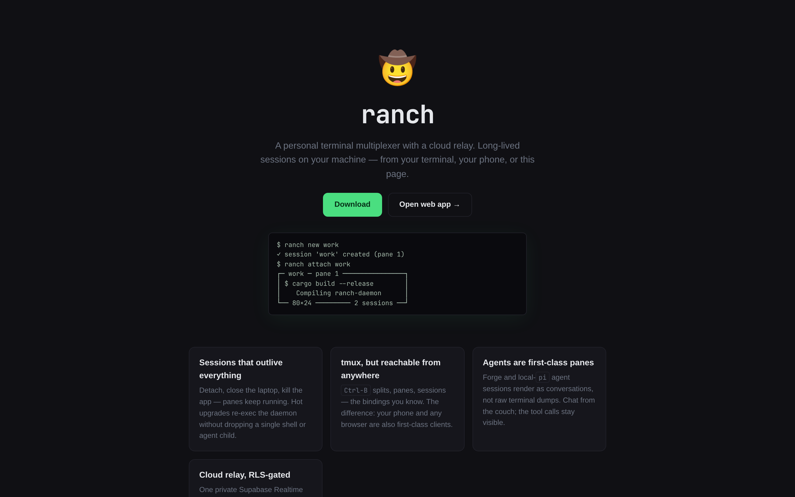

# ranch 🤠

A personal terminal multiplexer with a cloud relay. Long-lived sessions
on your own machine — reachable from your terminal, your phone, or any
browser.

**[⚡ Try the live demo](https://mule-ai.github.io/ranch/#/app)** — no
sign-up; one tap runs a sandboxed shell and an agent in a public demo
instance. Or watch the [Sever & Resume
demo](https://forge.jbutler.dev) on the forge side.



Sessions keep running while you're away. Reconnect from any device and
pick up exactly where you left off — including agent conversations.
tmux-style multiplexing is the core (a tmux *replacement*, not a
companion), and agent sessions (Forge, pi) are
first-class pane types that render as conversations, not raw terminal
dumps.

## Install

**Linux x86_64** — one static binary, no runtime dependencies:

```sh
curl -fsSL https://raw.githubusercontent.com/mule-ai/ranch-dist/main/ranch-linux-x86_64.tar.gz | tar xz
cd ranch-linux-x86_64
install ranch ~/.local/bin/ranch
ln -sf ranch ~/.local/bin/ranchd
```

Or grab the tarball / signed **Android APK** from
[**Releases**](https://github.com/mule-ai/ranch/releases/latest) or the
[download page](https://mule-ai.github.io/ranch/#/download).

<details>
<summary>Build from source</summary>

```sh
git clone https://github.com/mule-ai/ranch && cd ranch
make setup        # one-time: Zig 0.16 + pinned ghostty (for libghostty-vt)
make install      # ~/.local/bin/ranch (+ ranchd symlink)
make service      # systemd user unit for the daemon (optional)
```

Requires Rust (stable) + Zig 0.16; JDK 17 + the Android SDK only for
building the APK locally.

</details>

## Quick start

> **No install needed to kick the tires:** the [live
demo](https://mule-ai.github.io/ranch/#/app) signs you in to a shared
demo machine — a QuickJS sandbox shell (no fs, no net) and a no-tools
forge agent.

```sh
ranch login           # Google sign-in (once per device)
ranch register        # on a daemon host: register it with your account
ranch daemon          # run the daemon (or the systemd unit from `make service`)
ranch                 # interactive session manager
ranch new work        # create a session + attach
ranch machines        # list your machines (from any device)
ranch cloud           # list sessions across machines
```

Then open [the web app](https://mule-ai.github.io/ranch/#/app) or the
Android app: same sessions, same machines, live terminal, from anywhere.

`Ctrl-B` inside `ranch` is the tmux-style prefix: `%`/`"` split, arrows
move focus, `Ctrl`-arrows resize, `d` detaches, `c`/`s`/`,`,`&` manage
sessions. Sessions keep running while detached — and while your laptop
is closed.

## How it fits together

```
 local TUI ─┐                                      ┌─ phone (Expo)
 browser ───┼─ Supabase Realtime ── ranch daemon ──┼─ PTY panes (libghostty-vt)
 ranch CLI ─┘    (RLS-gated relay)                └─ agent children (pi, forge)
```

- **One binary** — `ranch` is the CLI/TUI *and* the daemon (`ranch
  daemon`, the `ranchd` symlink, or `--daemon`). Fully statically
  linked (musl + the ghostty VT engine compiled to a static archive):
  ~21 MB, zero runtime deps.
- **The daemon owns everything** — one server-side terminal emulator
  per pane, 30 ms coalesced output, sessions/panes/layout in
  `state.json`.
- **Sessions survive (almost) everything.** Two tiers:
  - *Tier 1* — daemon restart kills panes? `state.json` rebuilds
    sessions, panes, and agent conversations from disk on boot.
  - *Tier 2* — `ranch upgrade` hot-upgrades the daemon in place: it
    re-execs itself with `--inherit`, passing every PTY/agent/listener
    fd through the exec. Same PID, children never notice, zero dead
    panes.
- **Cloud relay** — a private Supabase Realtime channel per machine,
  RLS-gated to the owner + the machine itself. Terminal frames flow
  machine ⇄ cloud ⇄ remote client; heartbeats power the online
  indicator. Local clients never touch the cloud.
- **Multi-device identity** — Google OAuth sign-in; self-serve machine
  registration (`ranch register`, no admin credentials on devices);
  any number of daemons per account.

## Security model

- Machine identity is a dedicated Supabase Auth user per machine; its
  key is shown once at `ranch register` and stored `0600` on the host.
- Row Level Security everywhere: owners see only their own machines
  and sessions; realtime channels are joinable only by the owning user
  and the machine itself.
- The relay relays opaque frames — the cloud never sees terminal
  contents in plaintext at rest (frames live in-transit only).

## Development

```
crates/ranch         the binary: client (client.rs) + daemon (daemon.rs)
crates/ranch-protocol  wire protocol (same frames on socket + relay)
crates/ranch-vt        server-side terminal emulation (libghostty-vt)
web/               Vite + React web app (GitHub Pages)
mobile/            Expo Android app
supabase/migrations  schema + RLS policies
docs/SPEC.md       architecture, milestones M0–M4 + completion notes
docs/PROTOCOL.md   frame reference
```

```sh
make build         # static release binary
make test          # cargo test
npm --prefix web run dev
```

## Status

Working and tested: local multiplexing core (PTY + server-side
emulation, scrollback, resize reflow, tmux keys), attach TUI with split
panes, cloud relay + multi-device apps, agent panes (pi) with chat
bubbles, Tier-1 session restore, Tier-2 zero-downtime hot upgrades,
CI-published static binaries + signed APK.

In flight: Forge agent sessions end-to-end, mule workflow panes (M10).

## Docs

- [⚡ Live demo](https://mule-ai.github.io/ranch/#/app) — sandbox shell + agent, no sign-up
- [docs/SPEC.md](docs/SPEC.md) — research, architecture, milestone notes
- [docs/PROTOCOL.md](docs/PROTOCOL.md) — the wire protocol
- [Website](https://mule-ai.github.io/ranch/) · [Web app](https://mule-ai.github.io/ranch/#/app)
